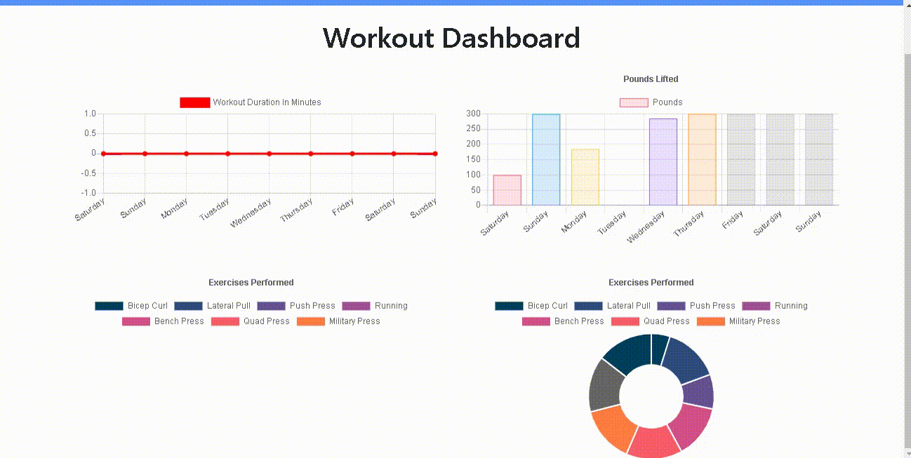

# Workout Tracker

link to deployed application: https://afternoon-cove-01786.herokuapp.com/

### Description: 

<ul>
    This application helps you keep track of all your exercises with a graph that summarizes your weekly workouts.  
</ul>

### Table of Contents
* [Usage](#usage)
* [Contributors](#contributors)
* [License](#license)

### Usage:

### License
<ul>
    This application is covered under the MIT License
</ul>

### Contributors:

[@mdu830](https://api.github.com/users/mdu830)

### Questions?

If you have any questions, feel free to contact me at:

GitHub: [@mdu830](https://api.github.com/users/mdu830)

Email: mdu830@yahoo.com
